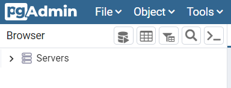
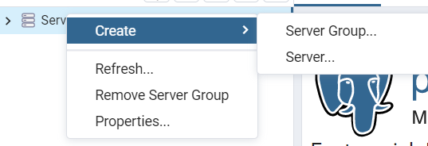
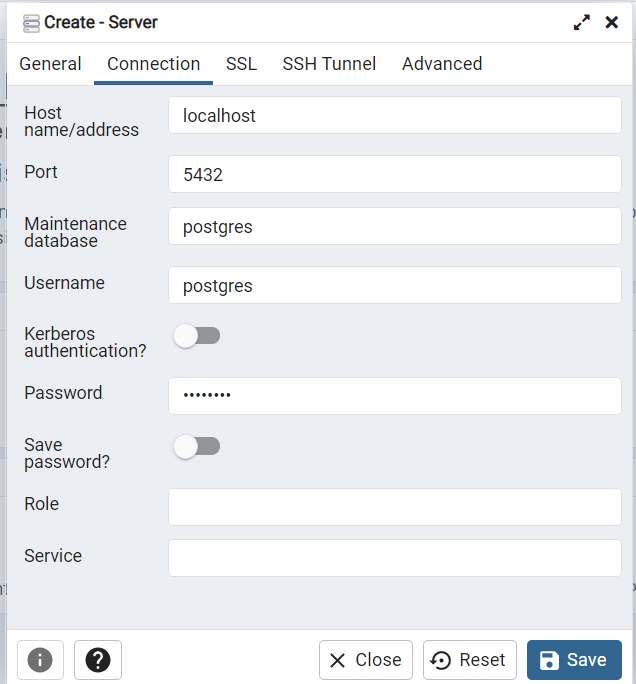
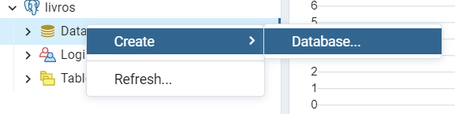
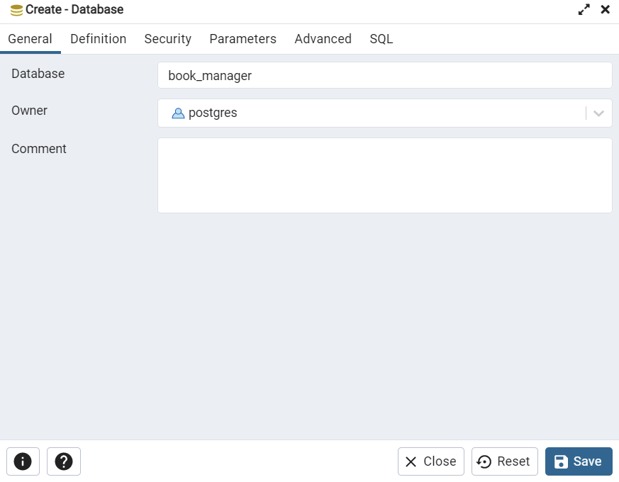

# Gerenciador de Livros com Django e PostgreSQL

## Descrição do Projeto
Sistema web para gerenciamento e catalogação de livros, possibilitando o armazenamento
destes livros em um banco de dados PostgreSQL e facilitando a vida das pessoas que, como nós ([Victor](https://github.com/VictorGM01)
e [Rapha](https://github.com/raphaelaferraz)), não possuem muito controle sobre seus livros 😅

Foi utilizado, para back-end, o banco de dados PostgreSQL e o framework Django com a linguagem de programação Python e, para o front-end, HTML5 e CSS.

<h1 align="center">
    
    
    
    
</h1>

## Status do Projeto :warning:
#### 🚧 👷🏻‍♂️ Em construção... 👷🏻‍♀️ 🚧

## Pré Requisitos
Antes de começar, é preciso que você tenha instalado na sua máquina as seguintes ferramentas:

[Git](https://git-scm.com/), [Python3](https://www.python.org/downloads/release/python-390/), [PostgreSQL](https://www.postgresql.org/download/windows/)

Além disso, é interessante instalar uma IDE para conseguir rodar a aplicação de maneira simplificada. Recomendo o uso do [Pycharm](https://www.jetbrains.com/pycharm/download/#section=windows) ou do [VSCode](https://code.visualstudio.com/download)

## Como rodar a aplicação ▶
### Instalar o Framework django e dependências
````bash
# No termnial, crie uma venv:
python -m venv ./venv

# Depois de criada, ative-a digitando no terminal (WINDOWS):
venv\Scripts\activate

# Depois de criada, ative-a digitando no terminal (MAC ou LINUX):
source /venv/bin/activate

# OBS.: A Venv sempre precisará estar ativada para que o servidor rode

# Instale o Django com pip install
pip install django

# Carregue os arquivos de estilização do site para o django
python manage.py collectstatic
````

### Configurar Banco de Dados
Após instalar o banco de dados, conforme solicitado em [Pré Requisitos](#pré-requisitos), crie um servidor chamado livros:

- Clique com o botão direito em 'Servidores':


- Clique em Create e depois em Server:


- Uma nova janela será aberta. Defina o nome como 'livros'. Em "Connection", defina o host como localhost e em password coloque a senha do seu PostgreSQL:


- Após Criar o servidor, clique com o botão direito em databases e crie um:


- Defina o nome do database como 'book_manager':



### Configurando conexão com o banco de dados
De volta ao terminal, instale as dependências necessárias:
````bash
# Instale o módulo psycopg2
pip install psycopg2

# Instale o módulo psycopg2-binary
pip install psycopg2-binary
````

- Abra o arquivo settings.py, na pasta gerenciador_de_livros
- Na linha 71, substitua USER pelo nome do seu usuário do servidor do PostgreSQL (para verificar o nome, abra o postgresql novamente, clique com o botão direito do mouse sobre o servidor que você criou (livros), clique em properties e depois em connection):
- 

  Obs.: Geralmente, o seu código deverá ficar assim: 'USER': 'postgres'
- Na linha 72, substitua PASSWORD pela sua senha do postreSQL:
- 

  Ex.: 'PASSWORD': 'senhadedemonstracao'

### Migrar modelo para o banco de dados
````bash
# Prepare o ambiente de migração:
python manage.py makemigrations

# Em seguida, faça a migração do modelo para o banco:
python manage.py migrate
````

### Criar Django-admin
No terminal, siga os seguintes passos:
````bash
# Crie um superuser
python manage.py createsuperuser

# Digite o seu nome de administrador, crie e confirme sua senha e insira seu e-mail nos campos indicados
````

### Subir servidor
No terminal, digite:

`python manage.py runserver`

Depois, clique no link que será gerado

## Desenvolvedores :octocat:
<table>
    <tr>
    <td align="center"><a href="https://github.com/VictorGM01"><br /><sub><b>Victor G. Marques</b></sub></a><br /><a href="https://github.com/VictorGM01" title="Victor">👨‍🚀💻</a></td>
    <td align="center"><a href="https://github.com/raphaelaferraz"><br /><sub><b>Raphaela G. Ferraz</b></sub></a><br /><a href="https://github.com/raphaelaferraz" title="Raphaela">👨‍🚀💻</a></td>
    </tr>
</table>